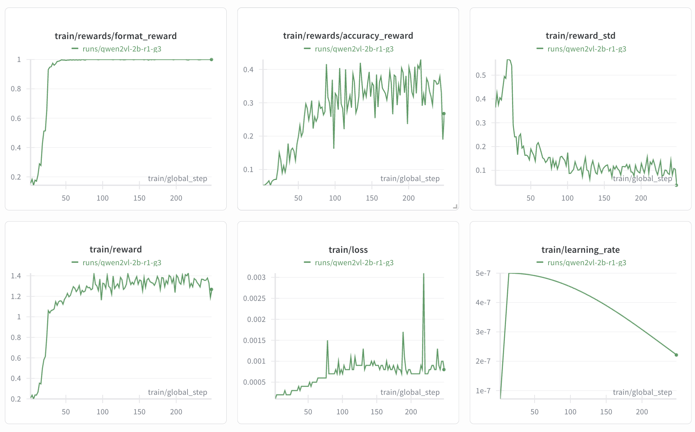

# Multimodal R1 + GeoGuessr
If we use R1-style RL to train a VLM to play GeoGuessr, can we elicit emergent reasoning traces that resemble [professional GeoGuessr players](https://somerandomstuff1.wordpress.com/2019/02/08/geoguessr-the-top-tips-tricks-and-techniques/)?

This repo adapts the GRPO training pipeline from [open-r1-multimodal](https://github.com/EvolvingLMMs-Lab/open-r1-multimodal) to geolocation, training [Qwen2-VL-2B](https://huggingface.co/Qwen/Qwen2-VL-2B-Instruct) to identify countries from street-view images while producing explicit reasoning traces (`<think>...</think> <answer>...</answer>`).

[Data](https://huggingface.co/datasets/mm-r1/g3-streetview-9k-balanced) | [Wandb Logs](https://wandb.ai/g-luo/geoguessr-r1)

## Problem Setup
Given a street-view image, the model must identify the country where the photo was taken, ideally while reasoning over visual cues (e.g., road signs, architecture, vegetation, landscape, driving side, etc.) that lead it to the correct final answer.

This problem is inspired by [G3: Geolocation via Guidebook Grounding](https://github.com/g-luo/geolocation_via_guidebook_grounding) (Luo et al., Findings of EMNLP 2022), which finds that allowing a visual model to retrieve expert text rationales significantly improves country classification. Here, rather than providing those rationales in a database, we ask whether RL can teach the model to generate them on its own.

## Quick Start

### Environment Setup
```bash
conda env create -f environment.yml
conda activate r1
```

### Training
The GeoGuessr visual task trains on street-view images with a country-match accuracy reward. The countdown task is a text-only arithmetic sanity check (from [TinyZero](https://github.com/Jiayi-Pan/TinyZero)) to verify the GRPO loop independently of vision.

```bash
# GeoGuessr multimodal task
accelerate launch --num_processes 4 \
    --config_file mini_r1/configs/deepspeed_zero3.yaml \
    mini_r1/scripts/task_visual.py \
    --config mini_r1/configs/task_visual.yaml

# Countdown text-only sanity
accelerate launch --num_processes 4 \
    --config_file mini_r1/configs/deepspeed_zero3.yaml \
    mini_r1/scripts/task_countdown.py \
    --config mini_r1/configs/task_countdown.yaml
```

## Preliminary Results

Here, we show results for an initial run on the G3 StreetView dataset (logs [here](https://wandb.ai/g-luo/geoguessr-r1/runs/1perqqo9)).



| Training Phase | Ground-Truth | Model Output |
|---|---|---|
| Early | France | `<think>`[...] 1. **Road signs**: There are no clear road signs visible [...] 2. **Buildings**: The architecture is not distinctly visible [...] `</think>` `<answer>` It is not possible to determine the country based on the provided image.`</answer>` |
| Middle | Turkey | `<think>` [...] The vegetation is dry and arid, which is typical of many deserts and desert-like regions. Based on these observations, the image most closely resembles the landscape and urban development in the Middle East, specifically in countries like Turkey`</think>``<answer>` Turkey `</answer>` |
| End | Ghana | `<answer>` Ghana `</answer>` |

Early on, the model produces verbose reasoning but can't commit to an answer. As the accuracy reward improves, the model is increasingly able to predict the correct country within the answer tokens, accompanied by a sensible rationale within the think tokens. However, by the end of training the reasoning traces collapse entirely; the model learns it can maximize reward by just outputting `<answer>Country</answer>` with no `<think>` block.

Additional process rewards can likely help with reasoning trace brevity. For example, a keyword matching reward referencing visual cues commonly used by expert GeoGuessr players (e.g., `road signs`, `vegetation`, `license plate`) could be a simple fix.